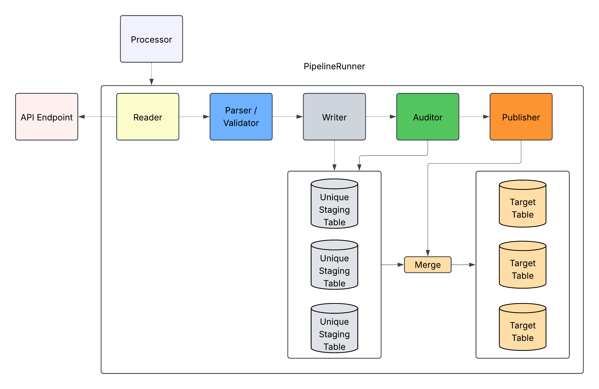

# ApiLoader

ApiLoader is a robust Data Engineering service that pulls data from APIs and parses the JSON into a tabular format before ingesting the data into a database.

 - Multiple API protocols supported (Rest, GraphQL)
   - GraphQL has limited support, let me know if you know of a good free GraphQL API!
 - Multiple Authentication Strategies (Auth, Bearer)
 - Multiple Pagination Strategies (Offset, Cursor, NextUrl, Query)
 - Flexible & Efficient JSON Parser
    - Easily parse JSON responses into tabular data models
 - Multiple Target Databases Supported (Postgres, ...)
 - OpenTelemetry Logging
    - Use your preferred logging platform
 - Webhook Integration for Internal Alerts
    - Use your preferred communication platform
 - Dockerized Application to deploy anywhere

## Why APIs?
APIs (Application Programming Interfaces) are the standard in tech to have services talk to each other. When it comes to ingesting data, many services already have APIs available to pull data from. APIs are:
 - Accessible
 - Standard
 - Reliable
 - Secure

## Table of Contents

- [Features](#features)
  - [Scalability](#scalability)
  - [Reliability](#reliability)
  - [Maintainability](#maintainability)
- [Design](#design)
  - [Processor](#processor)
  - [PipelineRunner](#pipelinerunner)
  - [Reader](#reader)
  - [Parser](#parser)
  - [Writer](#writer)
  - [Auditor](#auditor)
  - [Publisher](#publisher)
- [Pagination Strategies](#pagination-strategies)
  - [Offset Pagination](#offset-pagination)
  - [Cursor Pagination](#cursor-pagination)
  - [NextUrl Pagination](#nexturl-pagination)
  - [Query Pagination](#query-pagination)

## Features
### Scalability
 - Configuration Driven Pipelines
 - Parallel processing of APIs
 - Batch Processing for Memory Efficiency and Database Throttling
 - Asynchronous API Calls for Performance
 - Dynamic Table Creation
 - Proper Table Indexing for Scalable Database Operations
 - Schema Evolution for New Columns
 - Incremental Processing via Watermark Storage

### Reliability
 - Retries Request Calls & Database Operations to handle transient errors
 - Parsing Logic Handles any JSON format
 - Automatic Grain Validation
 - Validate Row-Level Data via Pydantic Models
 - Configurable Audit Queries
   - Audit API Data Holistically

### Maintainability
 - Type-Safe Repo Configuration Settings
 - Comprehensive Test Suite
 - Automatic Webhook Notifications for Internal Errors
 - Factory Pattern allows for easy implementation for new support

 ## Design
 The ApiLoader Framework is designed to easily paginate, parse out, and validate json responses before ingesting the data into a database. It empowers engineers to easily structure json responses into a tabular format that properly structures and supports further analytical use of the data.

 

### Processor
The Processor class coordinates the work and assigns thread workers (PipelineRunners) to process the APIs in parallel from the static queue. It can be triggered to process all APIs or only specific APIs/endpoints for granular control and scheduling.

### PipelineRunner
The PipelineRunner is the data pipeline that the API data passes through. It coordinates all of the pipeline classes while handling any errors gracefully. 

### Reader
The Reader class handles authentication and pagination utilizing source configuration to start pulling data from the API. Once the batch limit is reached, the reader yields the batched data to the Parser.

### Parser
The Parser class takes the SQLModels provided in the source configuration and parses out the batched data to easily create multiple tables and foreign keys. Once the data is parsed out, the batched table data is yielded to the Writer class.

### Writer
The Writer class takes the batched table data and inserts chunks into the stage tables.

### Auditor
The Auditor class checks all of the data pulled from the API that is stored in the stage tables. First, it automatically checks the table grains, utilizing the SQLModels. Then, it performs any custom aggregate audit queries given in the source configuration. If any of these checks fail, the pipeline stops and will trigger a webhook alert.

### Publisher
The Publisher class merges the staging table data into the production tables. It handles inserts/updates appropriately to sync the target table with the new data provided.

## Pagination Strategies
The ApiLoader Framework supports multiple pagination strategies, being flexible to pull from different API formats, protocols, and implementations.

### Offset Pagination

Uses `offset` and `limit` query parameters (e.g. `?offset=0&limit=5`). Fetches multiple pages in parallel up to `max_concurrent`, then continues until the API returns an empty page. Supports incremental runs via watermark (resumes from last committed offset).

### Cursor Pagination

Uses a cursor/token query parameter (e.g. `?cursor=abc123`). The next cursor is read from each response using a configurable key path (e.g. `next_cursor`). Supports incremental runs via watermark.

### NextUrl Pagination

The API returns the URL for the next page in the response (e.g. a `next_url` field). The reader follows that URL for each subsequent request until no next URL is returned. Supports incremental runs via watermark (resumes from the last committed URL).

### Query Pagination

Runs a SQL query against your database and triggers calls to an API for each record in the resultset. Addresses poor API design that forces the N+1 problem. Fetches multiple pages in parallel up to `max_concurrent`.